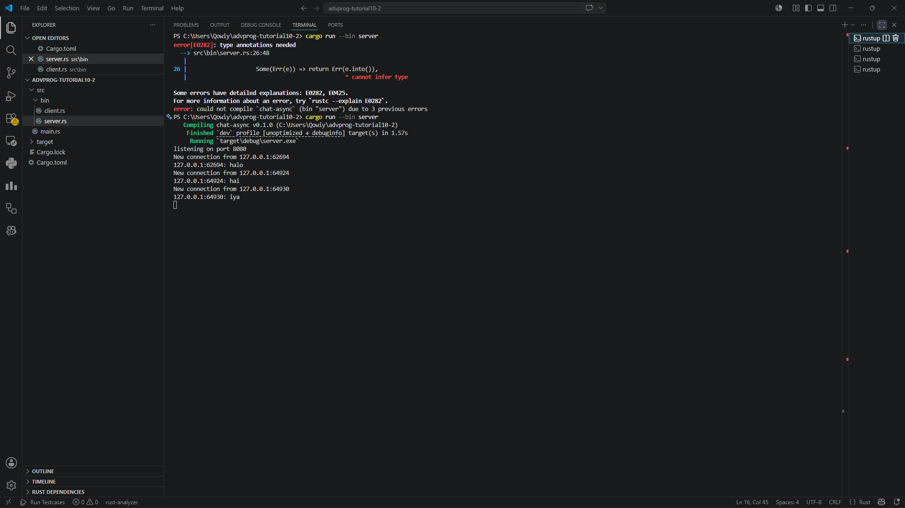
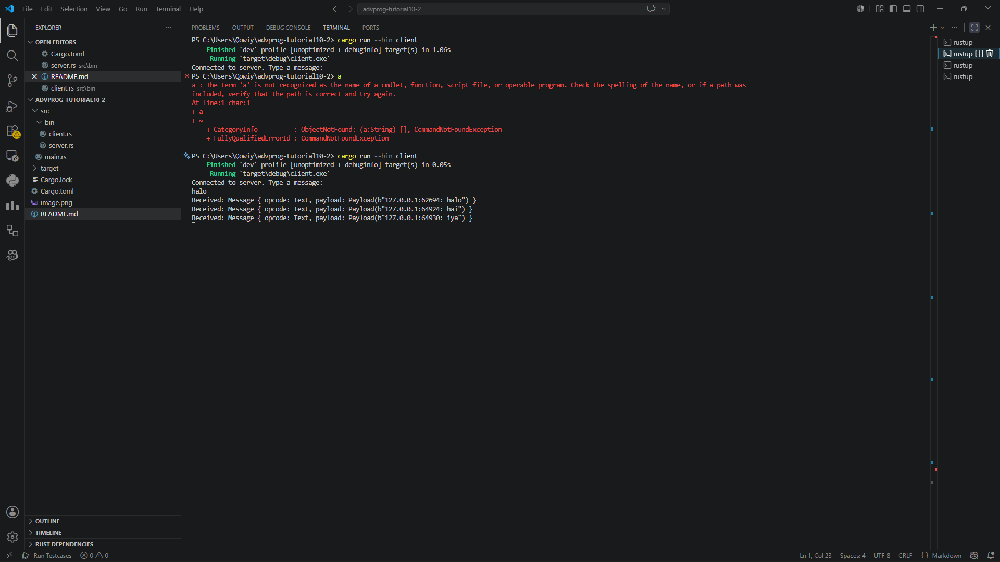
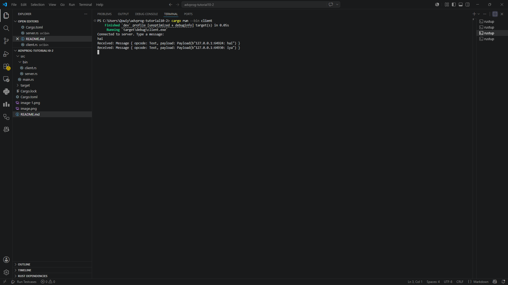
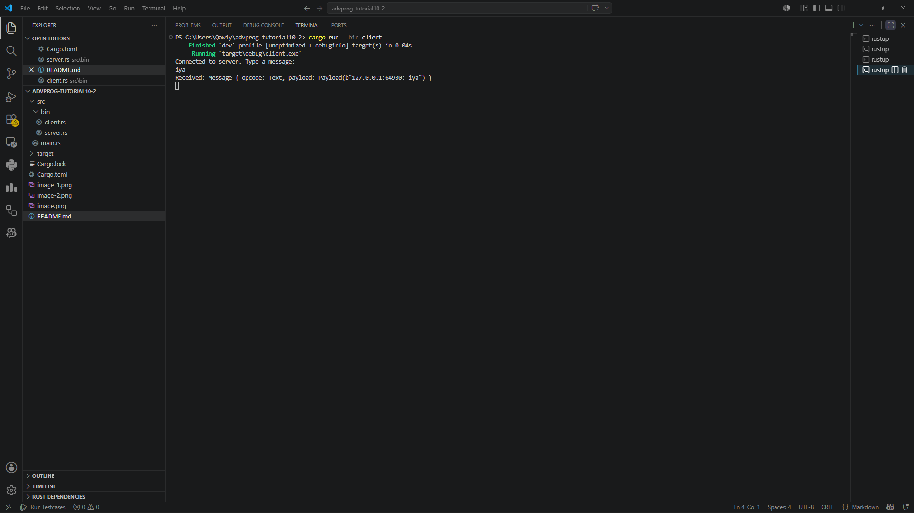
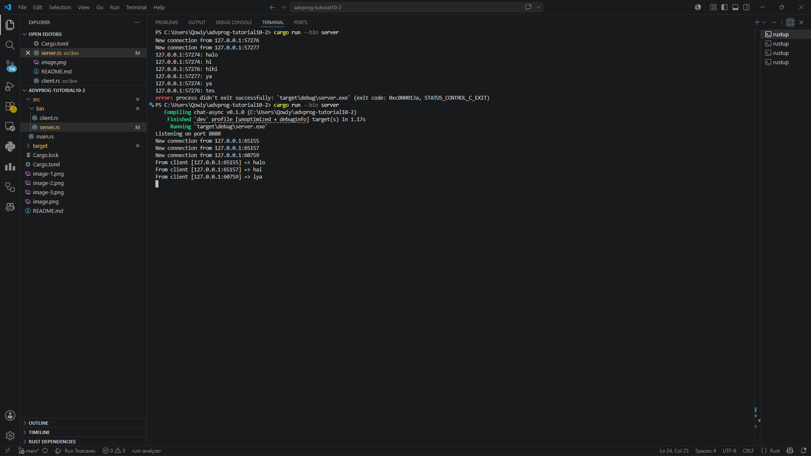

## Experiment 2.1: Kode Asli dan Cara Menjalankannya

Aplikasi broadcast chat menggunakan websocket server dan beberapa websocket client. Pertama, server dijalankan menggunakan:

cargo run --bin server

Setelah server aktif, client dapat dijalankan menggunakan:

cargo run --bin client

Ketika sebuah client mengirim pesan, server menerima pesan tersebut lalu melakukan broadcast ke seluruh client lain yang terhubung. Tutorial ini menunjukkan bagaimana asynchronous programming dapat menangani banyak koneksi secara bersamaan tanpa membuat program menjadi blocking.

## Experiment 2.2: Mengubah Port

Port websocket diubah dari `2000` menjadi `8080`.

Perubahan ini harus dilakukan pada sisi server maupun client. Server harus melakukan listen pada port `8080`, sedangkan client harus melakukan koneksi ke:

ws://127.0.0.1:8080

Jika hanya salah satu sisi yang diubah, maka koneksi websocket akan gagal karena server dan client menggunakan port yang berbeda.

## Experiment 2.3: Modifikasi Broadcast Chat

Pada eksperimen ini, saya melakukan modifikasi pada aplikasi broadcast chat dengan menambahkan informasi IP address dan port pengirim pada setiap pesan yang dikirim.

Sebelumnya, pesan yang diterima client hanya menampilkan isi pesan tanpa identitas pengirim. Saya mengubah bagian server sehingga setiap pesan broadcast memiliki format yang lebih informatif.

Perubahan yang dilakukan:

println!("From client [{addr}] => {text}");   
let _ = bcast_tx.send(format!("Client [{addr}] says: {text}"));

Dengan perubahan ini, setiap client dapat mengetahui siapa pengirim pesan berdasarkan IP address dan port koneksinya.

